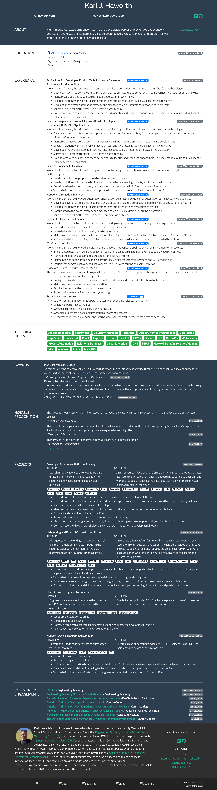

## Resume Website for Karl Haworth
### Print stlyes produce PDF resume. Best printed in Safari.

[](https://app.netlify.com/sites/karlhaworth/deploys)

#### Technologies Utilized
- [Bootstrap](https://getbootstrap.com)
- [Sass](https://sass-lang.com)
- [Eleventy](https://www.11ty.dev)
- [Netlify](https://netlify.com)

#### RUN WATCH
```bash
$ npm run watch
```

#### RUN BUILD
```bash
$ npm run build
```

## INSTALL
```bash
# BASE
$ npm init -y
$ npm install @11ty/eleventy --save-dev --save
$ npm install node-sass --save-dev --save
$ npm install onchange --save-dev --save
$ npm install npm-run-all --save-dev --save
# BOOTSTRAP
$ npm install bootstrap --save --save-dev
$ npm install jquery --save --save-dev
$ npm install popper.js --save --save-dev
# PUPPETEER SCREENSHOTS
$ npm install puppeteer --save --save-dev
# LIGHTBOX
$ npm install lightbox2 --save --save-dev
```

